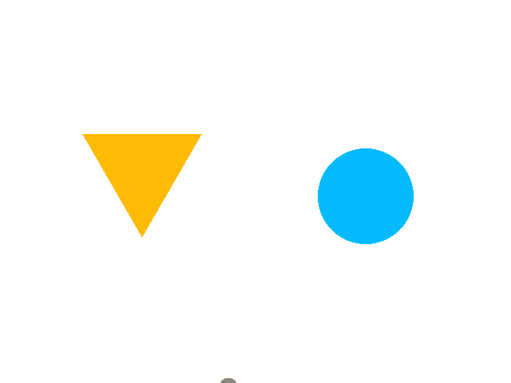

### 实验一：三角形与圆

##### 【说明】

- 用鼠标右键拖拽图形以平移，用鼠标左键拖拽图形以旋转
- 用鼠标中键拖拽图形以在锚点不变的情况下移动图形

##### 【演示】

##### 【实现】

- Graphic类：
  - public methods:
    - Translate(deltaPosition)
    - Rotate(deltaAngle)
    - MoveAnchor(deltaPosition)
    - Reanchor()
  - protected methods:
    - Transform(vec2 src) -> vec2 dist
    - InverseTransform(vec2 src) -> vec2 dist
    - ProjectToScreen(vec2 src) -> vec2 dist
- Triangle和Circle都继承于Graphics类：
  - Interfaces:
    - InObject(vec2 src) -> bool
    - GetVertices() -> vec3
    - GetColor() -> vec3(color)
    - GetRenderMode() -> int