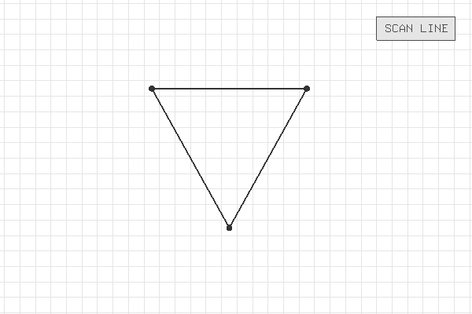
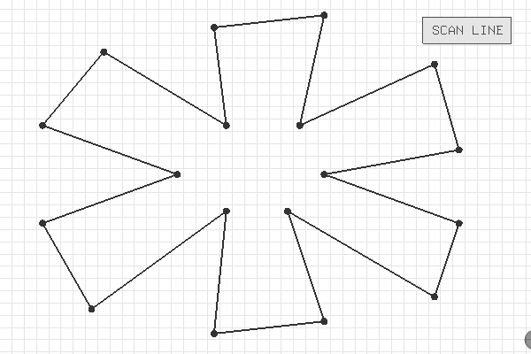

### 实验三：多边形的扫描线填充

##### 【说明】

- 用鼠标右键拖拽网格以平移，用鼠标中键拖拽网格以缩放
- 拖动多边形的顶点可以改变形状；在边上点击可以新建顶点
- 右键点击顶点可以删除顶点（最少三个顶点）
- 可以在Settings.h中自行更改部分设置

##### 【演示】

- 将SHOW_SCANNING_ANIMATION设置为true可以播放扫描线算法动画：

##### 【算法实现】

- ScanLine(grid, polygon)

1. 顺次遍历多边形的每个顶点，将它们加入edgeList
2. 对edgeList按照起始顶点的Y坐标从小到大的顺序排序
3. 从上到下依次扫描每一条线：
   1. 查找当前edgeList中最靠前的顶点，如果它已经进入扫描线范围则将其加入edgeLink
   2. 去除已经退出扫描范围的顶点
   3. 对edgeLink进行一趟排序，交换相邻的逆序对
   4. 将edgeLink中的顶点两两配对，填充每对区间内的像素格
   5. 将edgeLink中的顶点更新坐标

