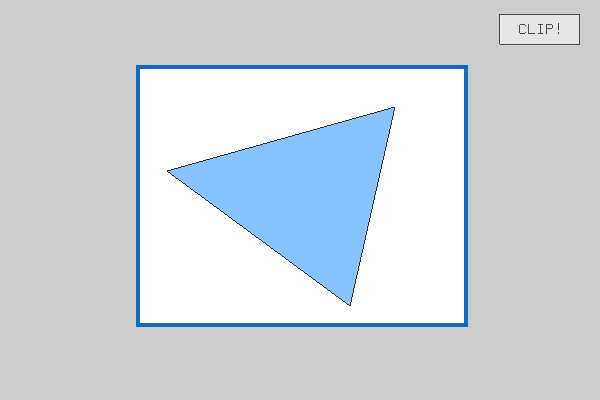

### 实验四：裁剪

##### 【说明】

- 拖动多边形的顶点可以改变形状；在边上点击可以新建顶点
- 拖动矩形边框可以更改裁剪范围，可以实时预览被裁剪的深色区域
- 点击 [ **Clip!** ] 按钮可以确认裁剪，多边形会被裁剪为矩形内的形状
- 可以在Settings.h中自行更改部分设置

##### 【演示】

##### 【算法实现】

- CropPolygon(polygon, clipFrame)
  - 对于裁剪边框的每条边执行裁剪函数CropPolygonByLine
- CropPolygonByLine(polygon, clipLineFrom, clipLineTo)
  - 遍历多边形的每条边：判断该条边相对于矩形边框的位置，从而得到裁剪后保留的顶点
  - 上述过程可以使用矩阵方程求解

