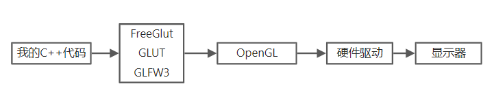

## SDU 图形学课程实验参考


该仓库中储存了 2020-2021 春季计算机图形学课程的实验代码。当时课程的实验要求见 [task.md](./task.md) 文档，以后学期的实验要求可能会改变，请以课程实验的具体要求为准。

代码是我（@Criheacy，2019级）当时的课程实验代码（不是标准答案），在这里开源出来供大家交流学习。有代码中的 bug 欢迎指正。

### 一些使用指南

每个文件夹中储存的是对应的实验代码，其中的 README 文件提供了**效果展示**和一些**实现细节**。

> 后面一些实验懒得写 README 了，可能以后有空会补上

实验 1-4 及 实验 6 使用的是 GLUT（OpenGL Utility Toolkit）框架，需要配置 glut.h 的头文件（实验指导书和网上应该有教程，具体可以咨询助教），然后将所有代码文件编译并链接，运行可执行文件即可。

实验 5、7、8 使用的是 GLFW3（OpenGL Framework 3）框架，需要配置 glfw3 相关文件，还需要一个 glad.c 的文件来帮助设定硬件版本。

一些实验因为需要涉及矩阵和向量运算，因此还引入了 GLM （OpenGL Math Library）辅助库，如果出现「glm.hpp 未找到」之类的问题可以去下载并配置 GLM 的库文件。

### 关于配置环境

我当时是在 Linux 系统上跑的这些，因为配环境比 windows 要容易一些。如果你也是使用的是 Linux 环境（或是虚拟机），这里列了一份需要安装的清单：

- cmake - 用于多个C、C++文件的编译、链接并生成最终程序，比gcc、g++好在能储存中间状态，比如上一次编译后只更改了一个文件，这时就可以只单独编译这一个文件并链接到其他文件上，不用全部重新编译
- gcc与g++ - C和C++的编译器，可以用MinGW安装
- glfw3 - OpenGL的与C++程序的中间媒介，用来封装一些OpenGL的接口提供给C++程序调用
- glut - 相对简单的OpenGL接口
- glad - 因为OpenGL和它的中间件们有很多不同的版本，不一定能保证兼容性，可能同一个函数在不同版本里叫不一样的名字，记忆起来太费劲。glad库就负责根据当前你的OpenGL版本信息生成一个映射库，把各种函数映射成对应版本里它的名字（打开glad.h会看到超长一串#define）方便调用；[这是生成链接](https://glad.dav1d.de/)

这里贴一篇当时配环境时写的 blog 的节选，这里面说了说当时关于 glfw 和 glut 的选择：

> 计算机图形学的底层引擎大概就是OpenGL了，它提供了一些能传递给调用硬件驱动的接口，但程序还不能直接使用这些接口（或者说很难使用），我们还需要一层转接层作为中间的媒介，把OpenGL的接口套一层壳转化成便于直接在C++程序中调用的形式。
>
> 
>
> 中间这个套壳层（学名叫Context toolkits）的选择真是一波三折。最初我看到了一篇教程叫[LearnOpenGL](https://learnopengl-cn.github.io/)，那上面介绍了叫glfw的中间层，鉴于这个教程看上去十分官方写得又详细，用过的都说好，我也就跟着用了。结果[第一个画三角形的实验](https://learnopengl-cn.github.io/01 Getting started/04 Hello Triangle/)就给我看傻了，上来先介绍了一大堆着色器，然后又是什么顶点数组VAO、顶点缓冲数组VBO、还有EBO什么的，整个第一章十好几页，当时看了三天还停留在第一页怎么理解上。不是说这个教程写的不好，主要是glfw门槛实在太高，现在回头看看发现第一个实验直接把图形学编程一大半的流程给讲完了。
>
> 于是最后一边骂gl废物（glfw首字母）一边无奈放弃这个教程改去用了别的同学推荐的glut。glut确实简单易上手，跟我以前写过的SDL2用法很相近。比如画一个三角形，掐头去尾核心代码就这几行：
>
> ```cpp
> glBegin(GL_POLYGON);
> glVertex3f(-0.5f, -0.5f, 0.0f); // left  
> glVertex3f(0.5f, -0.5f, 0.0f); // right  
> glVertex3f(0.0f, 0.5f, 0.0f); // top  
> glEnd();
> ```
>
> 简单又好理解。于是很长一段时间我都在用glut写代码，在它上面上搭建了自己的架构框架。开始几个实验如鱼得水十分顺利，比如当时的直线和画圆算法，再比如扫描线算法，当时不光做了整套支持缩放移动的网格系统用于展示像素，甚至还自己写了一套UI组件，包括一些小按钮、单选框多选框之类的，把助教吓了一跳。
>
> 本来这么写没什么大问题，但是当步入像素光栅化之后事情就开始不对劲起来。如果2D平面内要填充扫描填充一个500*500的屏幕，就需要循环250,000次依次填充每个像素点，这时候算上各种缓冲和输出维持30帧已经相当吃力了；如果是1080P的全屏幕，那每一帧就需要循环两百万次，我的笔记本i7的CPU直接卡成PPT。如果加上3D，相当于这样的光栅化过程要对每个显示出来的面执行一次，那就只能在实时和CPU之间选一个砍掉了。
>
> 科普一个冷知识：GPU不仅能用来挖矿，还可以用来渲染图像呢。GPU与CPU最主要的区别在于，GPU是多核处理器，单独一个核拿出来可能能力一般，但是它有成百上千个核组成，它最适合来处理数量庞大但是单个任务比较简单的工作（记住这一点，一会儿我们看看哪些任务有这个特点）。GPU是听不懂C++的，不能直接像调用API一样写个函数分一块活儿给它干，需要用它能听懂的语言给它写个程序，这种程序叫着色器（shader），而写OpenGL里面用来写shader的语言叫GLSL（OpenGL Shading Language）。
>
> 那怎么用上GLSL呢？这就回到glfw了。glut虽然容易上手，但是shader是封装好的，想要自定义比较难；而glfw没有默认的着色器，所有的着色器都需要自己手写，虽然上手很难但可以自己用GPU实现硬件加速，还能用shader做出很多花里胡哨的操作，我觉得像是那种难操作但是上限高的后期英雄。
>
> 于是我又抛弃了glut上搭了半天的架子回到了glfw上。经过这一顿折腾原来的glfw好理解多了，跟着[LearnOpenGL](https://learnopengl-cn.github.io/)的教程一点点往前探索着前进。

其实客观来说，使用 glut 也并不是不行，甚至从课程实验的角度来说是比较推荐的选择。因为很多算法（比如 Z-buffer 、光栅化）都是硬件中已经实现好了的，使用 glfw 只是在调接口而并不能自己看到或修改这些算法的内部细节；当时 blog 中说的实时性的问题其实在课程实验中并没有要求，一般都是渲染一张静态图像，实在不行卡一点就卡一点呗。我后来找到了一个[比较不错的软件渲染器实现](https://github.com/ssloy/tinyrenderer)，也贴在这里作参考。


