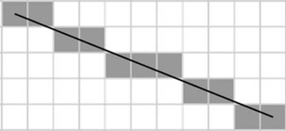
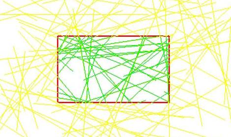

## 2020－2021春季计算机图形学实验要求

### 实验一：OpenGL基本使用

**实验目的**：

自行配置OpenGL环境，熟悉使用OpenGL

**基本要求**：

- 在屏幕上绘制出一个三角形和一个圆形，分别填充上你喜欢的颜色

- 可以使用鼠标分别拖动和旋转他们。

**验收/代码提交时间**：

2021.03.04——2021.3.25

 

### 实验二：直线与画圆算法

  **实验目的：**

理解光栅化，掌握几何数据如何经过一系列变换后转化为像素从而呈现在显示设备上。

**基本要求**：

- 实现DDA和Bresenham画线算法

- 实现画圆算法

- 请勿直接调用OpenGL库中提供的绘制线段和圆的函数，需手动模拟如何通过绘制像素来显示几何图形，效果可参考下图。（界面显示的是“虚拟的像素”）
- 可通过交互操作来确定线段的起点和终点。

**验收/代码提交时间**：

2021.03.11--2021.03.25

 

### 实验三：裁剪算法

**实验目的：**

掌握Liang-Barsky裁剪算法

**基本要求**：

- 实现Liang-Barsky裁剪算法

- 绘制任意方向\数量线段，可移动的裁剪窗口，通过不同颜色标识裁剪窗口内外的部分，效果可参考下图（可交互的移动裁剪窗口并实时显示裁剪效果）

- 画线的命令可以使用OpenGL提供的画线函数

**验收/代码提交时间**：

2021.03.18--2021.04.08

 

### 实验四：多边形的扫描转换与填充

**实验目的：**

了解多边形的表示方式，区域填充基本原理，掌握多边形的扫描转换算法

**基本要求**：

- 给定有序点对表示的多边形
- 实现x扫描线填充
- 实现改进的x扫描线填充（使用活性边表结构）

**验收/代码提交时间**：

2021.03.18--2021.04.08

 

### 实验五：Z-buffering算法

**实验目的：**

了解消隐与反走样的算法思想

**基本要求**：

- 在屏幕上绘制两个不同的图形，利用Z-buffering算法实现离视点更近的图形显示在上层。

- 使用反走样技术处理图像边缘的锯齿感，可生成图片格式放大查看效果。（95%）

- 仅使用一个深度缓存变量来实现Z-buffering算法 (100%)

 

**注**:

对OpenGL编程仍有困难的同学可以使用Games101的代码框架完成此次实验，可参考Games101的p3-p6

(https://space.bilibili.com/512313464?spm_id_from=333.788.b_765f7570696e666f.1）

(http://www.smartchair.org/f_/GAMES2020Course-YLQ/1962e/F3/Hw2.zip)

**验收/代码提交时间**：

2021.04.08--2021.05.06

 

### 实验六：Bézier曲线与B样条

**实验目的：**

掌握 Bézier曲线与B样条的原理与基本生成过程

**基本要求**：

- 实现 de Casteljau 算法来绘制使用不同数量的控制点表示Bézier 曲线

- 基于de boor 割角算法来绘制使用不同数量的控制点表示B样条曲线

- 支持insert/delete/move控制点，同时画出控制顶点/控制多边形/样条曲线。

**注：**

对OpenGL编程仍有困难的同学可以使用Games101的代码框架完成此次实验，实现方法可参考games 101 Lecture11（https://www.bilibili.com/video/BV1X7411F744?p=11）

**验收/代码提交时间**：

2021.04.29--2021.05.20

 

 

### 实验七：OFF文件读取与半边数据结构

**实验目的：**

了解三维模型的基本表达方式，熟悉常见的文件格式（OFF，OBJ，STL...）,理解并掌握半边（Half-Edge）数据结构

**基本要求**：

- 读取OFF文件转化为半边数据结构，并绘制在屏幕上

- 给定任一顶点索引，改变该顶点相邻顶点的颜色为红色，改变以该顶点为端点的边颜色为蓝色。（70%）

- 实现鼠标/键盘交互操作（平移，旋转，缩放）（80%）

- 实现任意一种三模模型的细分或简化算法（100%）

**注**：

1.有关半边结构的说明可参考

（https://www.flipcode.com/archives/The_Half-Edge_Data_Structure.shtml）

2.附件中提供了一份Arcball实现模型变换的代码，仅供参考。有关更多模型变换的知识可参考GAMES101 Lecture04 （https://www.bilibili.com/video/BV1X7411F744?p=4）

(https://www.bilibili.com/video/BV1X7411F744?p=12)

**验收/代码提交时间**：

2021.5.20--2021.6.3

 

### 实验八：光照模型

**实验目的：**

实现Blinn-Phong光照模型

**基本要求**：

- 加载三维模型，实现法向量、颜色、纹理颜色的插值(40%)。

- 实现 Blinn-Phong光照模型(90%)。

- 在实现 Blinn-Phong 的基础上，将纹理颜色视为公式中的 kd，实现 Texture Shading Fragment Shader(100%)。

**注**：

对OpenGL编程仍有困难的同学可以使用Games101的代码框架完成此次实验,实现方法参考GAMES101 Lecture07,08

(https://www.bilibili.com/video/BV1X7411F744?p=7)

**验收/代码提交时间**：

2021.06.03--2021.06.24

 